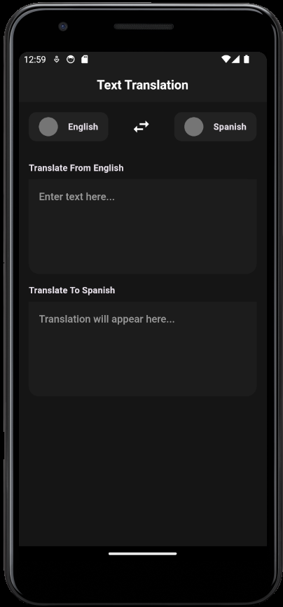
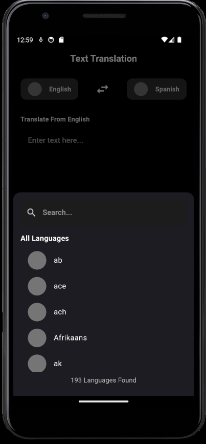

# Translator App

## Overview
The Translator App is a simple and efficient tool designed to help users translate text between different languages. It leverages RapidAPI's APIs to provide accurate and fast translations.

## Features
- Translate text between multiple languages
- User-friendly interface
- Fast and accurate translations
- Supports a wide range of languages

## Installation
To install the Translator App, follow these steps:
1. Clone the repository:
    ```bash
    git clone https://github.com/the-Sreejith/translator.git
    ```
2. Navigate to the project directory:
    ```bash
    cd translator
    ```
3. Install the required dependencies:
    ```bash
    flutter pub get
    ```
4. Create a lib/constants/api_keys.dart file and Put in your API_Key
    ```dart
    const API_KEY = '';
    const API_HOST = '';
    ```
5. Run the flutter app
    ```bash
    flutter run
    ```


## Screenshots
### Home Page


### Translation Page



## License
This project is licensed under the MIT License. See the [LICENSE](LICENSE) file for more information.

## Contact
For any questions or feedback, please contact us at [ssjksreejith@gmail.com](mailto:ssjksreejith@gmail.com).
